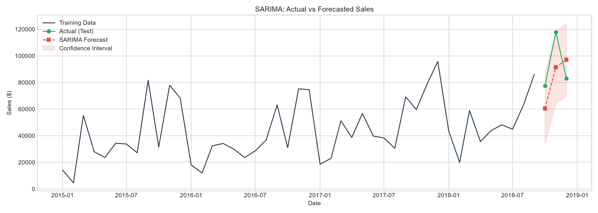
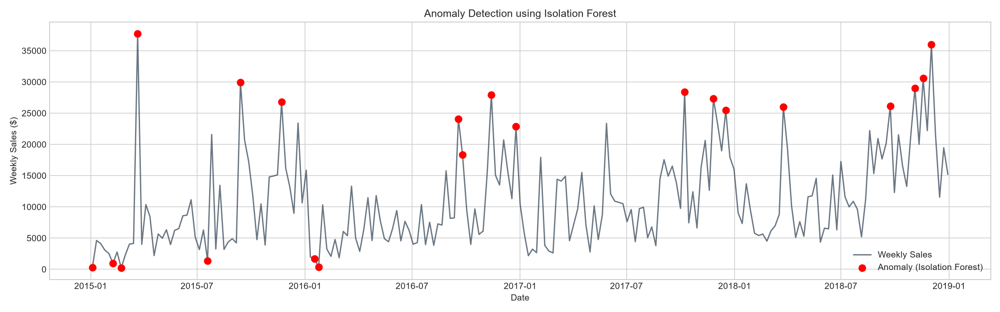
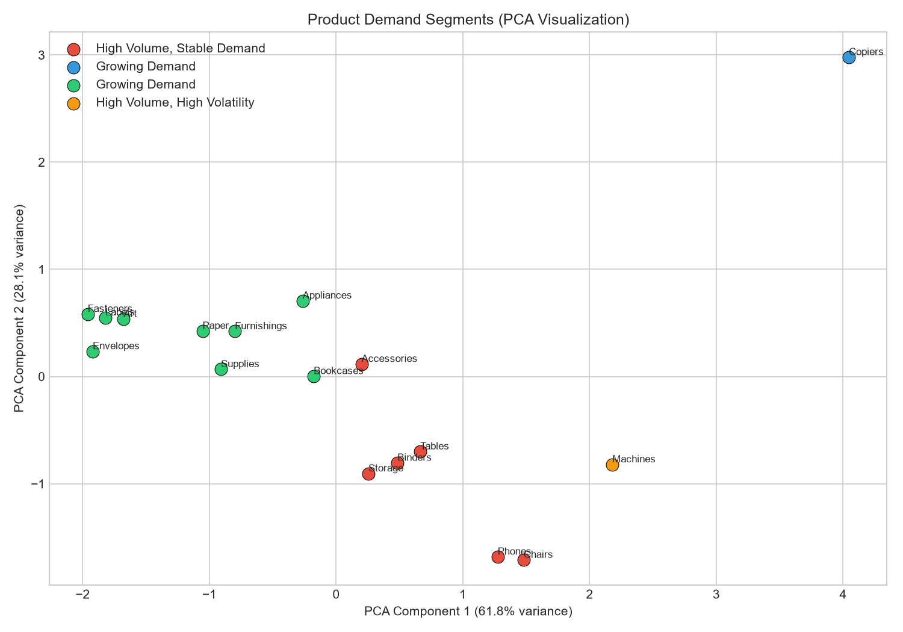

# Predictive Sales Forecasting & Retail Analytics Engine

Welcome to the **Predictive Sales Forecasting Engine**! 

Every retail and e-commerce company faces the exact same multi-million dollar question every day: *"How much of each product will we sell next month, and will we have enough stock to meet that demand?"* 

Getting this wrong costs businesses a fortune. Overstocking wastes precious warehouse space and capital, while understocking leads to stockouts, lost sales, and frustrated customers. 

This project solves this precise problem by moving beyond simple historical averages. It is a **production-ready, machine-learning-powered intelligence system** that not only forecasts future sales, but also detects anomalies in historical data and smartly groups product categories to optimize inventory strategy. Best of all, everything is served up in a sleek, interactive Streamlit dashboard designed specifically for business executives.

---

## What Does This System Actually Do?

1. **Demand Forecasting**
   We tested three radically different forecasting models (Statistical SARIMA, Facebook Prophet, and ML-based XGBoost) to predict future sales across various product categories and geographic regions. The dashboard utilizes the best-performing models to project demand 3-months into the future.
2. **Anomaly Detection**
   Sales data is notoriously messy. We implemented **Isolation Forests** and **Z-Score analysis** to automatically flag unusual spikes (e.g., unexpected viral trends, holiday sales) and drops (e.g., supply chain failures), allowing management to investigate abnormal weeks instantly.
3. **Product Segmentation**
   Not all products behave the same. We aggregated products into demand profiles using **K-Means Clustering** based on volume, growth, and volatility. Products are categorized into segments like *"High Volume, Stable Demand"* vs. *"Low Volume, High Volatility"*, dictating entirely different warehousing strategies.
4. **Executive Dashboard**
   All of this intelligence is heavily cached and packaged into an lightning-fast, 4-page interactive web application built with **Streamlit** and **Plotly**. 

---

## Visual Insights

Here is a glimpse into the kind of intelligence generated by the system:

### Time Series Forecasting (SARIMA)


### Weekly Anomaly Detection (Isolation Forest)


### Product Demand Segmentation (PCA & K-Means)


---

## Technology Stack

This system was built with speed, reliability, and modern tooling in mind:
* **Core Data Engine:** Python, Pandas, NumPy
* **Machine Learning & Time Series:** `statsmodels` (SARIMA), `prophet`, `xgboost`, `scikit-learn` (Isolation Forest, K-Means, PCA)
* **Visualizations:** Matplotlib, Seaborn, Plotly (Interactive)
* **Frontend Web App:** Streamlit
* **Package Manager:** [Astral `uv`](https://github.com/astral-sh/uv) (Extremely fast Rust-based Python package manager)

---

## Setup & Installation (Using `uv`)

This project uses `uv` to manage the virtual environment and dependencies. `uv` is significantly faster than standard `pip` and ensures a perfectly reproducible environment.

### 1. Prerequisites
- Ensure you have Python 3.10+ installed.
- Install `uv` if you haven't already:
  ```bash
  pip install uv
  ```

### 2. Clone and Setup
Navigate to the project directory and create the virtual environment, then install dependencies:
```bash
# Install dependencies from the requirements file using uv
uv pip install -r requirements.txt
```

### 3. Generate the Dashboard Data
Before running the dashboard, the data must be processed and serialized into a `.pkl` file.
1. Open `analysis.ipynb` in your favorite Jupyter environment.
2. Run all cells in the notebook. The final cell will train the models and export a file named `dashboard_data.pkl` into the project root.

### 4. Run the Streamlit Dashboard
Once `dashboard_data.pkl` is present, launch the web application via `uv`:
```bash
uv run streamlit run app.py
```
*The dashboard will automatically open in your default web browser at `http://localhost:8501`.*

---

## Project Structure

- `analysis.ipynb` — The comprehensive Jupyter Notebook containing all EDA, model training, evaluation, and data export logic.
- `app.py` — The interactive multi-page Streamlit application.
- `dashboard_data.pkl` — (Generated) The serialized dictionary containing all dataframes and forecasts required by the dashboard.
- `requirements.txt` — The deployment-ready list of dependencies.
- `charts/` — Static image outputs generated during the analysis phase.
- `train.csv` — The raw Superstore Sales dataset.
- `summary.docx` — The 2-page, jargon-free executive business report summarizing our findings and strategic recommendations.

---
*Built for data-driven decision making.*
